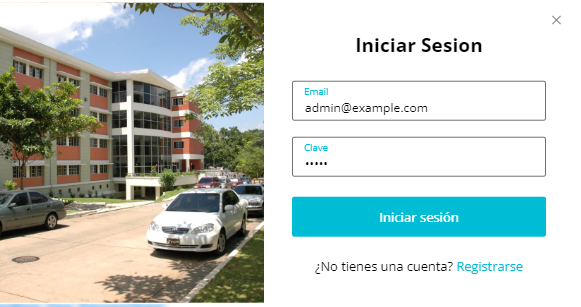
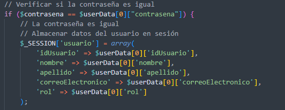
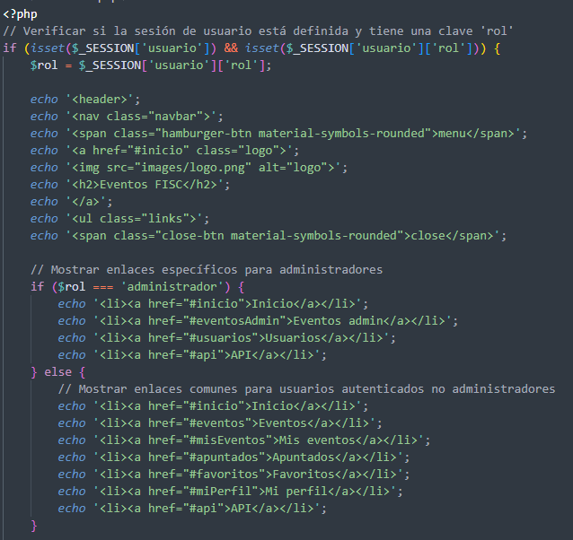
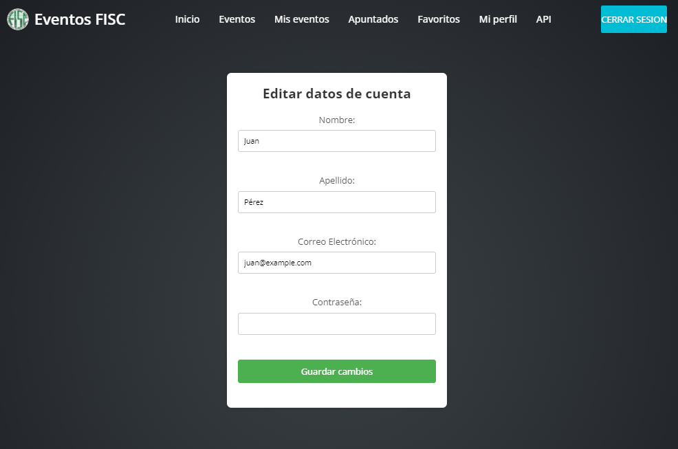

# Proyecto Eventos

Este proyecto de eventos tiene como objetivo crear, editar y borrar eventos por sesiones diferentes donde cada usuario tambien puede apuntarse o agregar a favoritos los que desee.
Tambien cuenta con una cuenta de administrador que puede cambiar el rol de otras cuentas o borrar todos los eventos de cualquier cuenta sin limite.
La cuenta del administrador es:
email: admin@example.com
password: admin

## Instrucciones de Configuración

Siga estos pasos para configurar y ejecutar el proyecto:

### Paso 1: Colocar la Carpeta del Proyecto

Coloque la carpeta del proyecto "proyecto-eventos" en la carpeta htdocs. 

### Paso 2: Colocar en la Carpeta htdocs de XAMPP (Opcional)

Si está utilizando XAMPP, coloque la carpeta "proyecto-eventos" en la carpeta `htdocs` de XAMPP. Si no está utilizando XAMPP, puede ignorar este paso.
Es importante que se llame proyecto-eventos para que la api tome bien la ruta y acceda a los datos.

### Paso 3: Iniciar el Servidor Apache de XAMPP

Inicie el servidor Apache de XAMPP y acceda al proyecto a través de [http://localhost/proyecto-eventos/](http://localhost/proyecto-eventos/).

### Paso 4: Ejecutar el Script SQL

Ejecute el script SQL incluido en el proyecto en PHPMyAdmin o en su editor de bases de datos de preferencia. Este script creará la base de datos y las tablas necesarias.

### Paso 5: Uso del Proyecto

¡Ahora puede utilizar la página según sus necesidades!

## Notas Adicionales

Aqui podemos ver que los input para iniciar sesion se autorrellenaran si el usuario ya ha iniciado sesion antes y fue exitoso. Se guarda la cookie en el navegador y se llenan los inputs.
Por ahi mismo tambien se pueden registrar nuevos usuarios.

Aqui notaremos que una vez que se ha iniciado sesion la sesion se inicia y se guardan los datos relevantes a la cuenta.

De esta manera usando la sesion validamos que rol tiene el usuario, si es rol "usuario" tendra acceso a crear eventos y lo comun de la pagina.
De lo contrario si es administrador tendra acceso a dos tabs exclusivos, "eventos admin" y "usuarios" donde podra borrar eventos sin limite y cambiar roles de cuentas existentes.

Asi se ve para el administrador.

Asi se ve para usuarios e invitados.

En este apartado si el usuario ha iniciado sesion, este puede actualizar sus datos en cualquiera de los campos vistos, a no ser que el email ya este siento utilizado, si es asi le enviara
un mensaje de error.
